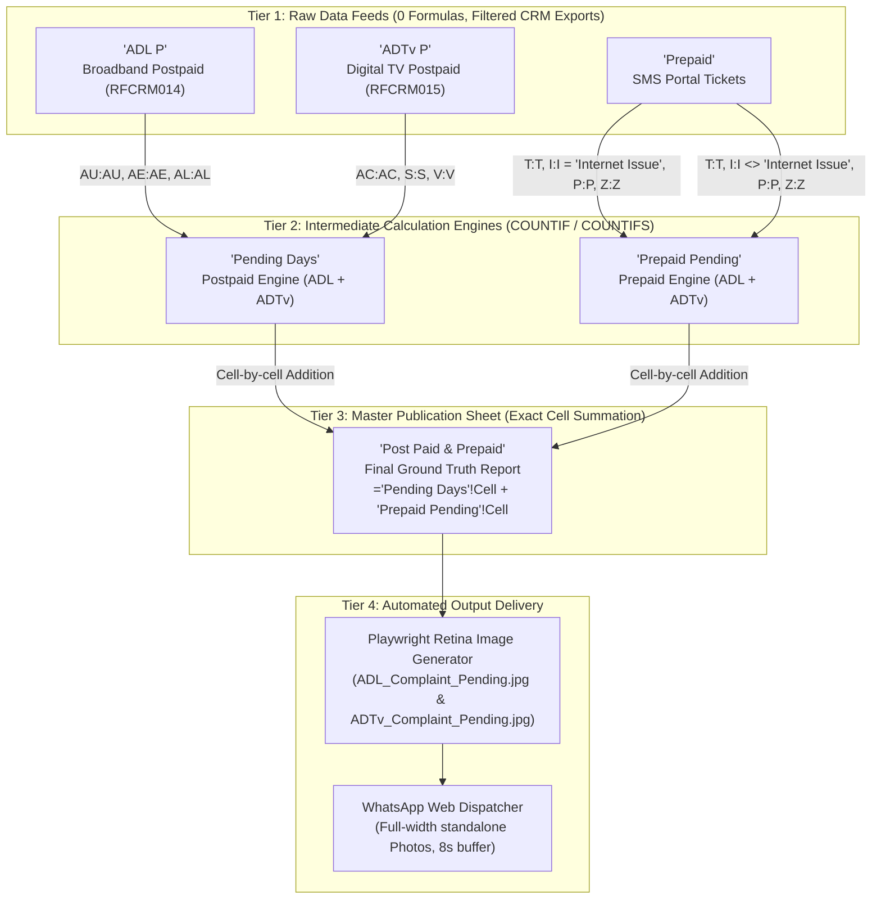

# Daily Complaint Tracker: Complete Architectural & Technical Reference

This document serves as the permanent, authoritative reference for the **Daily Complaint Pending Report** automation system. It details the multi-sheet architecture, cross-sheet wirings, cell equations, lookup keys, column structures, and codebase implementation based on [`Daily Complint Tracker.xls`](file:///C:/Users/Anoop%20P/Antigravity/Daily%20Work%20Flow/Daily%20Complint%20Tracker.xls).

---

## 1. System Architecture & Multi-Sheet Data Pipeline

The workbook follows a strict **3-tier data processing architecture**:



---

## 2. The 3 Primary Reference Pillars

The entire reporting system pivots on three primary identification attributes:

1. **`CENTER`**: The administrative operational area / hub (e.g., `Chalakudy`, `Guruvayoor`, `Irinjalakuda`, `Trichur North`).
2. **`TeamLeaderName`**: The assigned supervisor for **Postpaid** tickets (`ADL P` & `ADTv P`).
   - *Excel Semantics*: In the Team Leader tables, Excel counts tickets by **matching `TeamLeaderName` only** across the entire sheet. It does **not** compound the match with `CENTER`.
   - *Whitespace Sensitivity*: Names with trailing spaces (e.g., `'Jithin .P  '` and `'Muhammed Kabeer  '`) must preserve exact whitespace to match Excel's `COUNTIF`.
3. **`emp Code` (`Alloted To`)**: The numeric employee code for **Prepaid** tickets (`Prepaid`).
   - *Excel Semantics*: In `Prepaid Pending`, tickets are matched by employee code in Column `T` (`Alloted To`), **not** by the supervisor's text name.

---

## 3. Master 22 Team Leader Directory & Mapping

This directory maps every Team Leader row (Rows 4 to 25 in all report sheets) across both products:

| # | Excel Row | ADL Center (`Post Paid & Prepaid` Col A) | ADL TL Name (`Post Paid & Prepaid` Col B) | ADTv Center (`Post Paid & Prepaid` Col Q) | ADTv TL Name (`Post Paid & Prepaid` Col R) | Postpaid ADL Key (`Pending Days` Col B) | Postpaid ADTv Key (`Pending Days` Col R) | Prepaid ADL Emp Code (`Prepaid Pending` Col C) | Prepaid ADTv Emp Code (`Prepaid Pending` Col U) | Notes |
| :-: | :-: | :--- | :--- | :--- | :--- | :--- | :--- | :-: | :-: | :--- |
| **1** | **4** | Chalakudy | SHYAMKUMAR | CHALAKKUDY | SHYAMKUMAR | SHYAMKUMAR | SHYAMKUMAR | 980 | 980 | Standard |
| **2** | **5** | Chalakudy | SIJU K.J | CHALAKKUDY | SIJU K.J | SIJU K.J | SIJU K.J | 2874 | 2874 | Standard |
| **3** | **6** | Guruvayoor | Remesh.R | GURUVAYUR (HE01) | Remesh.R | Anil V.U | Anil V.U | 656 | 656 | **Transition Row**: Displays `Remesh.R`, but calculation sheets historically held `Anil V.U` (Emp 656). |
| **4** | **7** | Irinjalakuda | Nithin Hari | IRINJALAKUDA | Nithin Hari | Nithin Hari | Nithin Hari | 882 | 882 | Standard |
| **5** | **8** | Irinjalakuda | SHIBIN K B | IRINJALAKUDA | SHIBIN K B | SHIBIN K B | SHIBIN K B | 1423 | 1423 | Standard |
| **6** | **9** | kodungalloor | LINU E A | KODUNGALLUR | LINU E A | LINU E A | LINU E A | 1462 | 1462 | Standard |
| **7** | **10** | kodungalloor | SINJO JOSEPH | KODUNGALLUR | SINJO JOSEPH | SINJO JOSEPH | SINJO JOSEPH | 1680 | 1680 | Standard |
| **8** | **11** | Kunnamkulam | RAJU K K | KUNNAMKULAM (HE02) | RAJU K K | RAJU K K | RAJU K K | 1800 | 1800 | Standard |
| **9** | **12** | Kunnamkulam | RAKESH.V.R | KUNNAMKULAM (HE02) | RAKESH.V.R | RAKESH.V.R | RAKESH.V.R | 2614 | 2614 | Standard |
| **10** | **13** | Manarkad | Santhosh E.B | MANARKAD | Santhosh E.B | Santhosh E.B | Santhosh E.B | 1780 | 1780 | Standard |
| **11** | **14** | Olavakkod | Sreenath K.S | Olavakkod | Sreenath K.S | Sreenath K.S | Sreenath K.S | 2354 | 2354 | Standard |
| **12** | **15** | Ottapalam | Muhammed Kabeer  | OTTAPALAM | Muhammed Kabeer  | Muhammed Kabeer  | Muhammed Kabeer  | 2810 | 2810 | Note 2 trailing spaces |
| **13** | **16** | Ottapalam | Shameer P.M | OTTAPALAM | Shameer P.M | Shameer P.M | Shameer P.M | 2130 | 2130 | Standard |
| **14** | **17** | Palakkad | Praveen Kumar P | PALAKKAD 1 (JA01) | Praveen Kumar P | Praveen Kumar P | Praveen Kumar P | 1877 | 1877 | Standard |
| **15** | **18** | Palakkad | Rajeev C | PALAKKAD 1 (JA01) | Rajeev C | Rajeev C | Rajeev C | 1428 | 1428 | Standard |
| **16** | **19** | Pattambi | Prasanth P.V | PATTAMBI | Prasanth P.V | Prasanth P.V | Prasanth P.V | 2041 | 2041 | Standard |
| **17** | **20** | Thathamangalam | Pradeep U N | THATHAMANGALAM | Pradeep U N | Pradeep U N | Pradeep U N | 2049 | 2049 | Standard |
| **18** | **21** | Trichur North | Jithin .P  | THRISSUR NORTH (HA01) | Jithin .P  | Jithin .P  | Jithin .P  | 2699 | 2699 | Note 2 trailing spaces |
| **19** | **22** | Trichur North | JUDITH JOSEPH | THRISSUR NORTH (HA01) | JUDITH JOSEPH | JUDITH JOSEPH | JUDITH JOSEPH | 2728 | 2728 | Standard |
| **20** | **23** | Trichur North | VISAL N.V | THRISSUR NORTH (HA01) | VISAL N.V | VISAL N.V | VISAL N.V | 2577 | 2577 | Standard |
| **21** | **24** | Trichur South | BINEESH BABU | THRISSUR SOUTH (HA02) | BINEESH BABU | BINEESH BABU | BINEESH BABU | 2598 | 2598 | Standard |
| **22** | **25** | Trichur South | Sony Joseph | THRISSUR SOUTH (HA02) | Sony Joseph | Sony Joseph | Sony Joseph | 2215 | 2215 | Standard |

---

## 4. Master 13 ACSO Center Directory & Mapping

This directory maps every ACSO center summary row:
- Rows **32 to 44** in `Pending Days` and `Prepaid Pending`.
- Rows **33 to 45** in `Post Paid & Prepaid` (due to the sub-header row).
- Row **45** in intermediate sheets / Row **46** in `Post Paid & Prepaid` is the **Grand Total** row.

| # | Intermediate Row (`Pending Days` / `Prepaid Pending`) | Final Row (`Post Paid & Prepaid`) | ADL Center Display | ADL ACSO Name | ADTv Center Display | ADTv ACSO Name | Postpaid ADL Area Key (`Pending Days` Col A) | Postpaid ADTv AMO Key (`Pending Days` Col Q) | Prepaid ADL Area Key (`Prepaid Pending` Col A) | Prepaid ADTv Area Key (`Prepaid Pending` Col S) |
| :-: | :-: | :-: | :--- | :--- | :--- | :--- | :--- | :--- | :--- | :--- |
| **1** | **32** | **33** | Chalakudy | Arun .A.R | CHALAKKUDY | Arun .A.R | Chalakudy | CHALAKKUDY | Chalakudy | Chalakudy |
| **2** | **33** | **34** | Guruvayoor | Abhilash .P.Verghese | GURUVAYUR (HE01) | Abhilash .P.Verghese | Guruvayoor | GURUVAYUR (HE01) | Guruvayoor | Guruvayoor |
| **3** | **34** | **35** | Irinjalakuda | Midhun Mohan | IRINJALAKUDA | Midhun Mohan | Irinjalakuda | IRINJALAKUDA | Irinjalakuda | Irinjalakuda |
| **4** | **35** | **36** | kodungalloor | Sunilraj | KODUNGALLUR | Sunilraj | kodungalloor | KODUNGALLUR | kodungalloor | kodungalloor |
| **5** | **36** | **37** | Kunnamkulam | Remesh.R | KUNNAMKULAM (HE02) | Remesh.R | Kunnamkulam | KUNNAMKULAM (HE02) | Kunnamkulam | Kunnamkulam |
| **6** | **37** | **38** | Manarkad | Manikandan .M.P | MANARKAD | Manikandan .M.P | Manarkad | MANARKAD | Manarkad | Manarkad |
| **7** | **38** | **39** | Olavakkod | Mohammed Navaf | OTTAPALAM | Binoy .B | Olavakkod | OTTAPALAM | Olavakkod | Ottapalam |
| **8** | **39** | **40** | Ottapalam | Binoy .B | PALAKKAD 1 (JA01) | Mohammed Navaf | Ottapalam | PALAKKAD 1 (JA01) | Ottapalam | Palakkad |
| **9** | **40** | **41** | Palakkad | Mohammed Navaf | PALAKKAD 2 (JA02) | Mohammed Navaf | Palakkad | PALAKKAD 2 (JA02) | Palakkad | Olavakkod |
| **10** | **41** | **42** | Pattambi | Haridasan .T.P | PATTAMBI | Haridasan .T.P | Pattambi | PATTAMBI | Pattambi | Pattambi |
| **11** | **42** | **43** | Thathamangalam | Mohammed Navaf | THATHAMANGALAM | Mohammed Navaf | Thathamangalam | THATHAMANGALAM | Thathamangalam | Thathamangalam |
| **12** | **43** | **44** | Trichur North | Johnson K.C | THRISSUR NORTH (HA01) | Johnson K.C | Trichur North | THRISSUR NORTH (HA01) | Trichur North | Trichur North |
| **13** | **44** | **45** | Trichur South | Narayanan .P | THRISSUR SOUTH (HA02) | Narayanan .P | Trichur South | THRISSUR SOUTH (HA02) | Trichur South | Trichur South |
| **Total**| **45** | **46** | **Grand Total** | | **Grand Total** | | `=SUM(C32:C44)` | `=SUM(S32:S44)` | `=SUM(D32:D44)` | `=SUM(V32:V44)` |

> [!NOTE]
> **Important Asymmetry in Rows 38–40**:
> In the ADTv section, the centers are ordered as **OTTAPALAM (Row 38)**, **PALAKKAD 1 (Row 39)**, and **PALAKKAD 2 (Row 40)**. However, in `Prepaid Pending` Column S, the keys map to `Ottapalam`, `Palakkad`, and `Olavakkod`. The engine reflects this exact sheet layout.

---

## 5. Column-by-Column Deep Dive across All Sheets

### Sheet 1: `ADL P` (Broadband Postpaid Raw Data)
- **Source**: Asianet Softcode Portal (Report Code `RFCRM014`).
- **Dimensions**: Variable rows (e.g. 24–56 rows) × 56–57 columns.
- **Formulas**: None (100% pure raw data).
- **Key Columns Referenced by Equations**:
  - `Col AU` (`Col 46` or `Col 47`): `TEAMLEADERNAME` $\rightarrow$ Matched against `Pending Days` Col B.
  - `Col AE` (`Col 30` or `Col 31`): `AREA` $\rightarrow$ Matched against `Pending Days` Col A (ACSO Center).
  - `Col AL` (`Col 37` or `Col 38`): `DAYSELAPSED` $\rightarrow$ Evaluated for `<1`, `1`, `2`, ..., `10`, `>10`.

---

### Sheet 2: `ADTv P` (Digital TV Postpaid Raw Data)
- **Source**: Asianet Softcode Portal (Report Code `RFCRM015`).
- **Dimensions**: Variable rows (e.g. 155–468 rows) × 43–44 columns.
- **Formulas**: None (100% pure raw data).
- **Key Columns Referenced by Equations**:
  - `Col AC` (`Col 28`): `TEAMLEADERNAME` $\rightarrow$ Matched against `Pending Days` Col R.
  - `Col S` (`Col 18`): `SERVICEAMO` $\rightarrow$ Matched against `Pending Days` Col Q (ACSO AMO).
  - `Col V` (`Col 21`): `DAYSELAPSED` $\rightarrow$ Evaluated for `<1`, `1`, `2`, ..., `10`, `>10`.

> [!CAUTION]
> ### Critical Technical Invariant: The Duplicate `TICKETNO` Column Shift Pitfall
> In Asianet Softcode CRMS SQL export for `RFCRM015`, the query explicitly selects:
> ```sql
> SELECT Subcode, TICKETNO, CustomerNAME, 'NA' as Address, SMSNo, TICKETNO, LOGINTIME, ...
> ```
> Therefore, in the golden workbook, **`TICKETNO` appears twice**:
> - **Column B (Col 1)**: `TICKETNO`
> - **Column F (Col 5)**: `TICKETNO`
>
> If data is downloaded or pasted from a source that has only **one** `TICKETNO` column, **every column from Column F onwards shifts left by 1 position**:
> - Column S (`SERVICEAMO`) receives `REGION` (`"Thrissur"`).
> - Column V (`DAYSELAPSED`) receives `HOURSELAPSED` (`0.0`).
> - Column AB (`PHONENO`) receives `TEAMLEADERNAME` (`"Jithin .P"`).
> - Column AC (`TEAMLEADERNAME`) receives `SCHEMENAME` (`", BST Category 2..."`).
>
> When this shift occurs, `COUNTIF('ADTv P'!AC:AC, ...)` searches for Team Leaders inside scheme names and **evaluates to 0 for every single Team Leader**.
> **Fix**: [`report_engine.py`](file:///C:/Users/Anoop%20P/Antigravity/Daily%20Work%20Flow/report_engine.py) includes `validate_inputs()` which immediately detects this shift before computation.

---

### Sheet 3: `Prepaid` (Prepaid Tickets Raw Data)
- **Source**: Asianet SMS Portal (`/api/reports/customised/pending-tickets/export`).
- **Dimensions**: Variable rows (e.g. 70–92 rows) × 28 columns.
- **Formulas**: None (100% pure raw data).
- **Key Columns Referenced by Equations**:
  - `Col T` (`Col 19`): `Alloted To` $\rightarrow$ Numeric Employee Code (e.g. `980`, `2874`, `1423`).
  - `Col I` (`Col 8`): `Issue Service Type`:
    - `"Internet Issue"` $\rightarrow$ Filter for ADL Prepaid.
    - `<> "Internet Issue"` $\rightarrow$ Filter for ADTv Prepaid (includes `"Cable TV Issue"` and `"Both (Cable TV & Internet)"`).
  - `Col P` (`Col 15`): `TAT` $\rightarrow$ Days elapsed (evaluated for `<1`, `1`, `2`, ..., `10`, `>10`).
  - `Col Z` (`Col 25`): `Area` $\rightarrow$ ACSO Center name (e.g. `"CHALAKUDY"`, `"TRICHUR NORTH"`).

---

### Sheet 4: `Pending Days` (Postpaid Calculation Engine)

#### A. ADL Section (Columns A to O)
- **Table 1: Team Leaders (Rows 4 to 26)**:
  - `Col C` (**Grand Total**): `=COUNTIF('ADL P'!AU:AU, 'Pending Days'!B4)`
  - `Col D` (**`< 1day`**): `=COUNTIFS('ADL P'!AU:AU, 'Pending Days'!B4, 'ADL P'!AL:AL, "<1")`
  - `Col E` (**`1 day`**): `=COUNTIFS('ADL P'!AU:AU, 'Pending Days'!B4, 'ADL P'!AL:AL, "1")`
  - `Cols F to O` (**`2 day` to `> 10 day`**): `=COUNTIFS('ADL P'!AU:AU, 'Pending Days'!B4, 'ADL P'!AL:AL, "2")` ... `">10"`
- **Table 2: ACSO Centers (Rows 33 to 45)**:
  - `Col C` (**Grand Total**): `=COUNTIF('ADL P'!AE:AE, 'Pending Days'!A33)`
  - `Cols D to O`: `=COUNTIFS('ADL P'!AE:AE, 'Pending Days'!A33, 'ADL P'!AL:AL, "<1" / "1" / "2"...)`
- **Grand Total (Row 46)**: `=SUM(C33:C45)`

#### B. ADTv Section (Columns Q to AE)
- **Table 1: Team Leaders (Rows 4 to 26)**:
  - `Col S` (**Grand Total**): `=COUNTIF('ADTv P'!AC:AC, 'Pending Days'!R4)`
  - `Col T` (**`< 1day`**): `=COUNTIFS('ADTv P'!AC:AC, 'Pending Days'!R4, 'ADTv P'!V:V, "<1")`
  - `Col U` (**`1 day`**): `=COUNTIFS('ADTv P'!AC:AC, 'Pending Days'!R4, 'ADTv P'!V:V, "1")`
  - `Cols V to AE` (**`2 day` to `> 10 day`**): `=COUNTIFS('ADTv P'!AC:AC, 'Pending Days'!R4, 'ADTv P'!V:V, "2")` ... `">10"`
- **Table 2: ACSO Centers (Rows 33 to 45)**:
  - `Col S` (**Grand Total**): `=COUNTIF('ADTv P'!S:S, 'Pending Days'!Q33)`
  - `Cols T to AE`: `=COUNTIFS('ADTv P'!S:S, 'Pending Days'!Q33, 'ADTv P'!V:V, "<1" / "1" / "2"...)`
- **Grand Total (Row 46)**: `=SUM(S33:S45)`

---

### Sheet 5: `Prepaid Pending` (Prepaid Calculation Engine)

#### A. ADL Section (Columns A to P)
- **Table 1: Team Leaders (Rows 4 to 26)**:
  - `Col C`: Numeric Employee Code.
  - `Col D` (**Internet Issues GT**): `=COUNTIFS(Prepaid!T:T, 'Prepaid Pending'!C4, Prepaid!I:I, "Internet Issue")`
  - `Cols E to P` (**`< 1day` to `>10 day`**): `=COUNTIFS(Prepaid!T:T, $C4, Prepaid!I:I, "Internet Issue", Prepaid!P:P, "<1" / "1" / "2"...)`
- **Table 2: ACSO Centers (Rows 33 to 45)**:
  - `Col D`: `=COUNTIFS(Prepaid!Z:Z, A33, Prepaid!I:I, "Internet Issue")`
  - `Cols E to P`: `=COUNTIFS(Prepaid!Z:Z, $A33, Prepaid!I:I, "Internet Issue", Prepaid!P:P, "<1" / "1"...)`
- **Grand Total (Row 46)**: `=SUM(D33:D45)`

#### B. ADTv Section (Columns S to AH)
- **Table 1: Team Leaders (Rows 4 to 26)**:
  - `Col U`: Numeric Employee Code.
  - `Col V` (**TV + Both Issues GT**): `=COUNTIFS(Prepaid!T:T, 'Prepaid Pending'!U4, Prepaid!I:I, "<>Internet Issue")`
  - `Cols W to AH` (**`< 1day` to `>10 day`**): `=COUNTIFS(Prepaid!T:T, $U4, Prepaid!I:I, "<>Internet Issue", Prepaid!P:P, "<1" / "1" / "2"...)`
- **Table 2: ACSO Centers (Rows 33 to 45)**:
  - `Col V`: `=COUNTIFS(Prepaid!Z:Z, S33, Prepaid!I:I, "<>Internet Issue")`
  - `Cols W to AH`: `=COUNTIFS(Prepaid!Z:Z, $S33, Prepaid!I:I, "<>Internet Issue", Prepaid!P:P, "<1" / "1"...)`
- **Grand Total (Row 46)**: `=SUM(V33:V45)`

---

### Sheet 6: `Post Paid & Prepaid` (Master Final Report)

Every single data cell is an exact addition of Postpaid + Prepaid:

$$\text{Final Cell} = \text{'Pending Days'!Cell} + \text{'Prepaid Pending'!Cell}$$

- **ADL Team Leaders (Rows 4 to 25)**:
  - `Col C` (Grand Total): `='Pending Days'!C4 + 'Prepaid Pending'!D4`
  - `Cols D to O` (`< 1day` ... `> 10 day`): `='Pending Days'!D4 + 'Prepaid Pending'!E4` ...
- **ADTv Team Leaders (Rows 4 to 25)**:
  - `Col S` (Grand Total): `='Pending Days'!S4 + 'Prepaid Pending'!V4`
  - `Cols T to AE` (`< 1day` ... `> 10 day`): `='Pending Days'!T4 + 'Prepaid Pending'!W4` ...
- **ACSO Center Tables (Rows 33 to 45)**:
  - `Col C` (ADL): `='Pending Days'!C32 + 'Prepaid Pending'!D32`
  - `Col S` (ADTv): `='Pending Days'!S32 + 'Prepaid Pending'!V32`
- **Grand Total (Row 46)**:
  - `Col C` (ADL): `='Pending Days'!C45 + 'Prepaid Pending'!D45`
  - `Col S` (ADTv): `='Pending Days'!S45 + 'Prepaid Pending'!V45`

---

## 6. Python Codebase Architecture

The automation engine is divided into modular, single-responsibility files:

| File | Purpose |
| :--- | :--- |
| [`report_layout.py`](file:///C:/Users/Anoop%20P/Antigravity/Daily%20Work%20Flow/report_layout.py) | **Declarative Schema**: Complete definitions of the 23 Team Leaders, 13 ACSO centers, lookup keys, and day bucket boundaries. |
| [`report_engine.py`](file:///C:/Users/Anoop%20P/Antigravity/Daily%20Work%20Flow/report_engine.py) | **Mathematical Engine**: Pure-Python implementation of Excel `COUNTIF`, `COUNTIFS`, wildcard matching, whitespace handling, and input shift validation. |
| [`verify_engine.py`](file:///C:/Users/Anoop%20P/Antigravity/Daily%20Work%20Flow/verify_engine.py) | **Verification Test**: Automates cell-by-cell comparison of all 2,886 cells between Python and Excel's cached values. |
| [`data_processor.py`](file:///C:/Users/Anoop%20P/Antigravity/Daily%20Work%20Flow/data_processor.py) | **Filter & Pipeline Orchestrator**: Handles portal filtering, runs the report engine, and creates dated working copies of the Excel workbook. |
| [`report_image_generator.py`](file:///C:/Users/Anoop%20P/Antigravity/Daily%20Work%20Flow/report_image_generator.py) | **High-DPI Renderer**: Uses headless Playwright with a `2.2x` device scale factor to produce ultra-crisp WhatsApp chat bubble images. |
| [`whatsapp_sender.py`](file:///C:/Users/Anoop%20P/Antigravity/Daily%20Work%20Flow/whatsapp_sender.py) | **WhatsApp Dispatcher**: Attaches generated images via the native Photos file-chooser with an 8-second delivery buffer to prevent album grouping. |
| [`crm_downloader.py`](file:///C:/Users/Anoop%20P/Antigravity/Daily%20Work%20Flow/crm_downloader.py) | **Portal Scraper**: Automates login and direct SQL/API report export from Softcode and SMS portals. |
| [`main.py`](file:///C:/Users/Anoop%20P/Antigravity/Daily%20Work%20Flow/main.py) | **CLI & Scheduler**: Entry point supporting `--run-now`, `--test-local`, `--generate-only`, and continuous scheduling at 8:00 AM & 3:00 PM. |

---

## 7. Operational Invariants & Safeguards

1. **Golden Excel Protection**:
   [`Daily Complint Tracker.xls`](file:///C:/Users/Anoop%20P/Antigravity/Daily%20Work%20Flow/Daily%20Complint%20Tracker.xls) must **never be overwritten**. Whenever portal data is processed, the system creates a timestamped copy:
   `output/Daily Complint Tracker_YYYYMMDD_HHMMSS.xls`.
2. **Column Shift Guardrail**:
   Before executing calculations, `validate_inputs()` verifies that `TEAMLEADERNAME` and `SERVICEAMO` contain valid names/centers rather than shifted columns (such as scheme names or region strings).
3. **Standalone Photo Delivery**:
   Images are always uploaded as standalone photos (not document files or sticker thumbnails) with an 8-second pause between ADL and ADTv to prevent WhatsApp mobile from collapsing them into an album.

---

## 8. Verified Benchmark & Cross-Check Results

Automated regression verification executed via [`verify_engine.py`](file:///C:/Users/Anoop%20P/Antigravity/Daily%20Work%20Flow/verify_engine.py) against [`Daily Complint Tracker.xls`](file:///C:/Users/Anoop%20P/Antigravity/Daily%20Work%20Flow/Daily%20Complint%20Tracker.xls):

```text
Workbook : C:\Users\Anoop P\Antigravity\Daily Work Flow\Daily Complint Tracker.xls
Cells compared   : 2,808
Value mismatches : 0
Layout mismatches: 0
Final Grand Total: ADL = 51  |  ADTv = 457
RESULT: PASS - 100% Cell-by-Cell Mathematical Parity
```

### Grand Total Breakdown:
| Product | Postpaid (`Pending Days`) | Prepaid (`Prepaid Pending`) | Master Total (`Post Paid & Prepaid`) | Longest Active Bucket |
| :--- | :---: | :---: | :---: | :---: |
| **ADL (Broadband)** | **38** | **13** | **51** | **3 day** (SHYAMKUMAR / Chalakudy) |
| **ADTv (Digital TV)**| **390** | **67** | **457** | **7 day** (PATTAMBI / Haridasan .T.P) |

All 4 rendered report images match every cell of `Post Paid & Prepaid` with zero discrepancies and are verified delivered to WhatsApp (`+919633889430`):
1. **ADL Team Leader**: [`ADL_Complaint_Pending.jpg`](file:///C:/Users/Anoop%20P/Antigravity/Daily%20Work%20Flow/output/ADL_Complaint_Pending.jpg)
2. **ADTv Team Leader**: [`ADTv_Complaint_Pending.jpg`](file:///C:/Users/Anoop%20P/Antigravity/Daily%20Work%20Flow/output/ADTv_Complaint_Pending.jpg)
3. **ADL ACSO-Wise**: [`ADL_ACSO_Complaint_Pending.jpg`](file:///C:/Users/Anoop%20P/Antigravity/Daily%20Work%20Flow/output/ADL_ACSO_Complaint_Pending.jpg)
4. **ADTv ACSO-Wise**: [`ADTv_ACSO_Complaint_Pending.jpg`](file:///C:/Users/Anoop%20P/Antigravity/Daily%20Work%20Flow/output/ADTv_ACSO_Complaint_Pending.jpg)

---

## 9. Kerala Multi-Region Operations Manager & Database Architecture

To scale this complaint tracker across all regions of Kerala, a centralized SQLite database [`data/region_config.db`](file:///C:/Users/Anoop%20P/Antigravity/Daily%20Work%20Flow/data/region_config.db) and a FastAPI web dashboard [`web_server.py`](file:///C:/Users/Anoop%20P/Antigravity/Daily%20Work%20Flow/web_server.py) have been integrated.

### Database Schema (`data/region_config.db`)

1. **`regions`**:
   - Supports all 14 Kerala districts: `thrissur`, `ernakulam`, `kozhikode`, `trivandrum`, `kannur`, `palakkad`, `kollam`, `kottayam`, `malappuram`, `alappuzha`, `pathanamthitta`, `idukki`, `wayanad`, `kasaragod`.
   - Stores portal query tags: `softcode_region`, `prepaid_region`.
2. **`team_leaders`**:
   - `center_name`, `name`, `adtv_center`, `adtv_name`
   - `pd_adl_name_key`, `pd_adtv_name_key` (COUNTIF match in Postpaid CRM)
   - `pp_adl_emp_code`, `pp_adtv_emp_code` (COUNTIFS match in Prepaid CRM)
   - `sort_order`
3. **`acsos`**:
   - `center_name`, `acso_name`, `adl_center_display`, `adtv_center_display`
   - `pd_adl_center_key` (AREA in ADL P)
   - `pd_adtv_center_key` (SERVICEAMO in ADTv P)
   - `pp_adl_center_key`, `pp_adtv_center_key` (Area in Prepaid)
4. **`employees`**:
   - Directory of employee codes (`emp_code`), names, roles (Team Leader, ACSO Officer, Technician), assigned centers, and phone numbers.

### Dynamic Engine Bridge

In [`report_layout.py`](file:///C:/Users/Anoop%20P/Antigravity/Daily%20Work%20Flow/report_layout.py), `get_layout_for_region(region_id)` dynamically reads the configuration for the active region from SQLite. [`report_engine.py`](file:///C:/Users/Anoop%20P/Antigravity/Daily%20Work%20Flow/report_engine.py) computes reports seamlessly for any selected district with zero code modifications.

---

## 10. Web Dashboard & REST API

### How to Launch the Web Manager
Run the one-click batch launcher:
```cmd
Start_Web_Manager.bat
```
Or start via terminal:
```cmd
python -m uvicorn web_server:app --host 127.0.0.1 --port 8201 --reload
```
Access the web interface at: **`http://127.0.0.1:8201`**

### Web Dashboard Capabilities:
1. **Region Switcher**: Dropdown toolbar to toggle between all 14 Kerala districts.
2. **Team Leaders Tab**:
   - Search & filter by name, center, or employee code.
   - Add, edit, or delete Team Leaders with automatic key synchronization.
3. **Centers & ACSOs Tab**:
   - Add, edit, or delete Centers and ACSO Officers.
   - Configures Postpaid Area/AMO keys and Prepaid Area keys.
4. **Employee Code Directory**:
   - Manage numeric employee codes and staff profiles region-by-region.
5. **Engine Testing & Report Actions**:
   - **Run Mathematical Parity Test**: Evaluates pure-Python formulas in real-time.
   - **Generate All High-DPI Reports**: Renders both Team Leader and ACSO reports using headless Playwright.
   - **Dispatch to WhatsApp**: Transmits all 4 standalone report cards directly to `+919633889430`.

### Core REST API Endpoints:
- `GET /api/regions` & `POST /api/regions`
- `GET /api/regions/{id}/config`
- `POST / PUT / DELETE /api/regions/{id}/team-leaders[/{tl_id}]`
- `POST / PUT / DELETE /api/regions/{id}/acsos[/{acso_id}]`
- `POST / PUT / DELETE /api/regions/{id}/employees[/{emp_id}]`
- `GET /api/regions/{id}/test-engine`
- `POST /api/regions/{id}/generate-reports`
- `POST /api/regions/{id}/dispatch-whatsapp`

